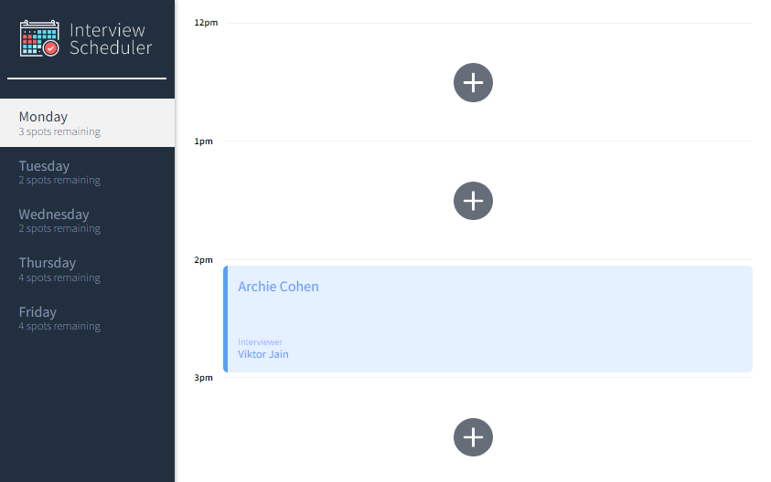
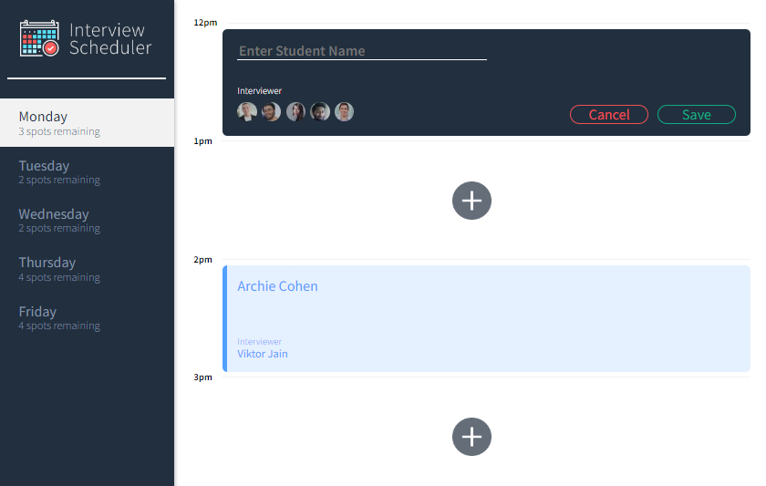
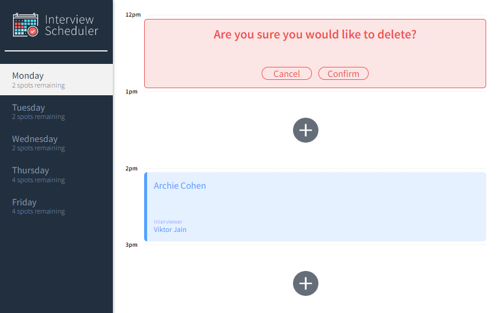

# Interview Scheduler
Interview Scheduler is a single-page app built using React.js. It allows an user to book, edit or cancel interviews for each day of the week. Several testing development libraries were used for testing, such as: Storybook, Webpack Dev Server, Jest and Cypress. The app is live at: https://darling-mooncake-61322e.netlify.app/.

# Getting Started

1. Install all dependencies with npm install command.
2. Download the Scheduler API server and follow the instructions at https://github.com/jhon-u/scheduler-api to set it up.
3. Run the Webpack Development Server with `npm start'.

## Dependencies

* axios: "^0.20.0"
* classnames: "^2.2.6"
* normalize.css: "^8.0.1"
* react: "^16.9.0"
* react-dom: "^16.9.0"
* react-scripts: "3.4.4"


## Running Webpack Development Server

```sh
npm start
```

## Running Jest Test Framework

```sh
npm test
```

## Running Storybook Visual Testbed

```sh
npm run storybook
```

# Screenshots




